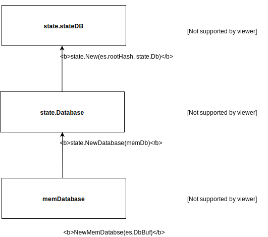

# Solidity smart contracts on Byzcoin


## The Byzcoin Virtual Machine contract

The bvm contract is a byzcoin contract that copies the Ethereum Virtual Machine ([EVM](https://en.wikipedia.org/wiki/Ethereum#Virtual_Machine)) to allow execution of arbitrary solidity code on the byzcoin ledger. 
As such in inherits from the Ethereum security model.
 
 The contract supports the following instructions :  

- `Spawn` Instantiate a new ledger for testing the BVM
- `Invoke:display` display the balance of a given account
- `Invoke:credit` credits an address with a given amount
- `Invoke:transaction` sends a transaction to the ledger containing either a new contract code or a transaction to an existing contract

## Ethereum transactions 
To execute a transaction such as deploying a contract or interacting with an existing contract you will need to sign the transaction with a private key containing enough ether to pay for the execution of the transaction.
You can create a keypair using the `keys.go` method and then credit your address using the credit instruction.

## How to deploy and interact with a contract


## Memory abstraction layers 


## Ethereum structure

Defined as 
```golang
type ES struct {
	DbBuf []byte
	RootHash common.Hash
}
```

represents the general state change in the Ethereum model. It is needed to reinstantiate the state database with the differents balances and contracts stored.
To save the root hash : 

```
es.RootHash := sdb.Commit
```

where sdb is the state.stateDb. To save the database 

```
es.DbBuf, err = memdb.Dump()
```

after having commited the memory database
```
err = db.Database().TrieDB().Commit(es.RootHash, true)
		if err != nil {
			return nil, nil, err
		}
```

To get the different databases, simply use the `getDB()` method in the `params.go`


## Files

The following files are in this directory:

- `bvmContract.go` defines the byzcoin contract that interacts with the Ethereum Virtual Machine
- `database.go` redefines the ethereum database functions to be compatible with Byzcoin
- `params.go` defines the parameter of the BVM
- `keys.go` helper methods for Ethereum key management 
- `service.go` only serves to register the contract with ByzCoin. If you
want to give more power to your service, be sure to look at the
[../service](service example).
- `proto.go` has the definitions that will be translated into protobuf

